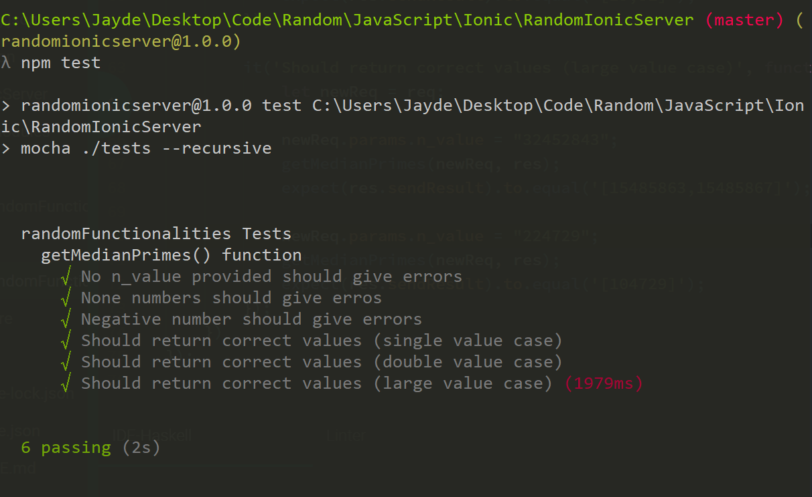
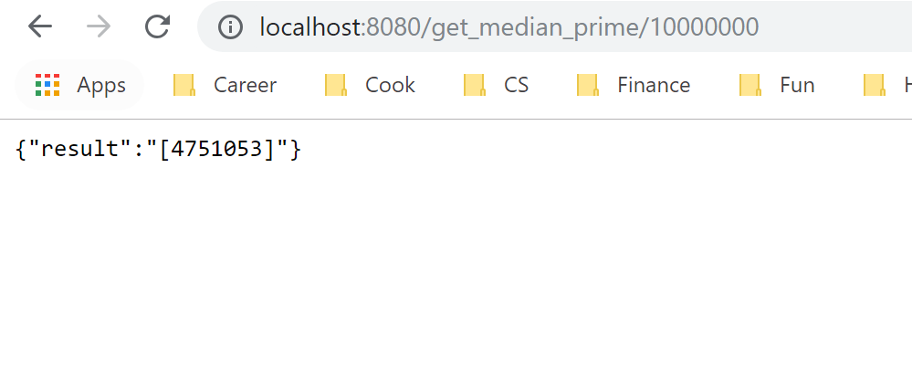

# Random Ionic Server
Random stuff

[Ionic Demo on Heroku]()
[Front end ionic repo link]()

## Currently have
[Getting median of prime numbers before a positive N]()

# Setup

Using Express and Node.js for the backend. Make sure you have recent node installed.

1. **Install Required libraries**

```bash
$ npm install
```

2. **Test**

```bash
$ npm test
```

The tests are in the test folder.



2. **Running locally**

```bash
$ npm start
```

I set it to be on 8080, feel free to change though. Right now it only supports one single route: localhost:8080/get_median_prime/value_of_n, and it will return the median prime number up to and including n as result.

